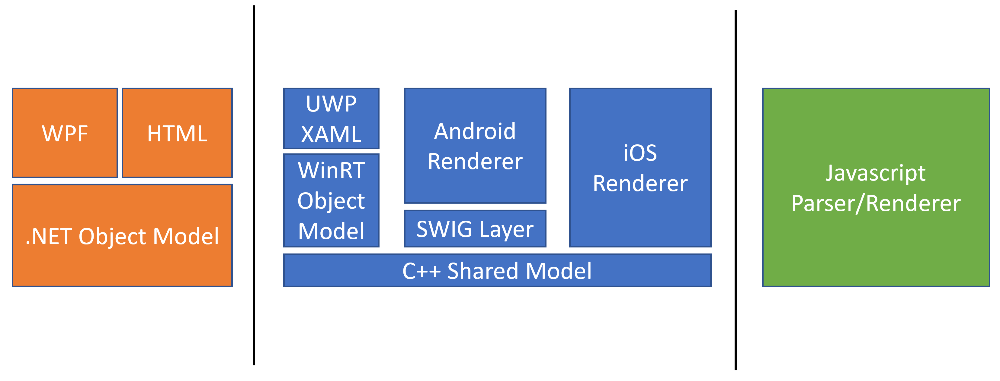
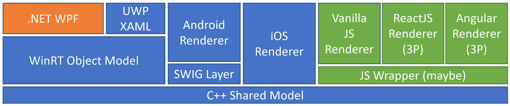

# Reconciling the Adaptive Cards Platform

## Context

Adaptive Cards as a platform fills a relatively unique niche in the broader software ecosystem. At its core, Adaptive
Cards is a JSON format for describing interactive pieces of card-like UI. JSON documents conforming to this schema can
be rendered natively and safely on a variety of OS and UI platforms:

* UWP
* .NET WPF
* .NET HTML (server-side)
* Android
* iOS
* Web

Renderers for other UI stacks have also been developed (or are under development) by third parties: ReactNative,
ReactJS, Blazor, VueJS, and others.

### Highlevel Architecture



### .NET Renderers

C#-implemented object model, plus renderers for WPF and HTML.

### Shared Model Renderers

All of the JSON parsing and object model building is done in a [single common C++
library](https://github.com/microsoft/AdaptiveCards/tree/main/source/shared/cpp) that is consumed and wrapped in various
ways as platform-appropriate.

* UWP - comprised of two pieces: a UWP object model (basically a layer to project the shared model to the WinRT), and a
UWP XAML renderer.
* iOS - builds directly against the shared library source and renders for iOS targets.
* Android - wraps the shared model using a tool called [`SWIG`](http://swig.org/) to make Java interop possible.

### The Javascript (or NodeJS) renderer

A [renderer](https://github.com/microsoft/AdaptiveCards/tree/main/source/nodejs/adaptivecards) written in Typescript
using native JSON parsing and generating styleable HTML. Note that we also have a [card
designer](https://adaptivecards.io/designer/) that leverages this renderer.

## Problem/Motivation

As our customer base has expanded, the team has found itself dealing with the consequences of delivering across three
base platforms:
* increased development costs and attendant schedule pressure
* siloing of dev talent
* cross-platform inconsistencies
* diverging developer experiences as platforms skew relative to each other
* difficulty delivering large experiences while meeting our "on any platform" promise
* increased engineering system complexity and cost

### An Illustrative Example

Put simply, when we implement a new feature in Adaptive Cards, we implement it a bunch of times. Take, for example,
implementing a simple new card element. Here's the work that needs to occur in order to accommodate this new feature (or
at least most of it):

1. Hold design discussions to settle on look, behavior, and JSON schema representation
1. Author JSON schema changes
1. Author JSON sample and test files
1. Implement parsing and object model for .NET
1. Implement parsing and object model in C++ Shared Model
1. Implement parsing and object model in Typescript
1. Implement WinRT object model wrapper
1. Implement SWIG interface for Java interop
1. Implement rendering in WPF
1. Implement rendering in .NET HTML
1. Implement rendering in UWP XAML
1. Implement rendering in Android
1. Implement rendering in iOS
1. Implement rendering in Typescript

Other work not accounted for above:
* Addition of new feature to the Designer
* Investigations to make sure that the new element can be implemented in a reasonable timeframe on all supported
  platforms (e.g. do all UI platforms provide the controls we need)
* Investigations to make sure that the new element interacts correctly with existing functionality (e.g. bleed or
  ToggleVisibility)
* API surface design
* Any custom styling affordances that might be needed for each rendering platform
* Unit tests
* UI tests
* Manual testing and validation
* Other compliance tasks (A11y, Perf, etc.)
* Documentation and other Communications

### Foreseeable Consequences

When a feature is implemented independently this many times, it's almost guaranteed that inconsistencies will creep in.
Does Javascript allow `1` or `"1"` for a property while the Shared Model only allows `"1"`? Does .NET WPF include extra
padding around the control it uses? Seemingly trivial implementation-time choices or oversights can wind up surfacing
later as a small difference between platforms. It's not impossible to get 100% consistent across all of our platforms,
but the odds are against it. These small (or sometimes large) divergences between platforms can lead to unhappy
customers and partners as we have failed to deliver on our promise of portability.

In addition to the consistency problem, there's also the issue of cost. If the above looks like a lot of work, that's
because it is. The amount of work required has left the team less agile than we would like to be. We're slower at
delivering partner requests and innovating in the space than we'd like. If anything, it gets more difficult with every
new bit of functionality we add.

### Growth Opportunities

There are myriad approaches to solve the size-of-work problem. I think if Adaptive Cards is to continue to be
successful, we need to be willing to take some risks and make big changes in support of managing costs (many of these
efforts are already under way):

* Reduce drag on the dev team by improving
  * Engineering systems
  * Test availability and coverage
  * Misc. processes
* Continuously improve our design discussions to catch problems prior to implementation
* Be more strategic in feature planning
* Make sure we're right-sizing our platform investments (up to and including deprecating under-utilized renderers)
* Share as much code as possible to reduce (or eliminate) reimplementation

**This last point is the focus of this document.**

## Investigation

As I understand it, the .NET platform was the first renderer to be developed and was used as to prototype features. The
Shared Model and Javascript platforms came shortly thereafter. In the early days, having distinct implmentations was
deemed as somewhat important to prove that Adaptive Cards as a platform could be arbitrarily replicated -- meaning that
we didn't have any platform-specific ties and thus could deliver the promise of Adaptive Cards across any platform.

C#/.NET was an obvious choice as a base for the WPF and server-side HTML renderers. Javascript made sense for
client-side HTML rendering. C++ was chosen as the language for the Shared Model used across the other platforms since it
was the greatest common denominator for iOS, Android, and UWP.

Do those choices still stand? I think that any one of these renderer choices would be made the same way in isolation
today, but if code reuse was the biggest priority, *could* you make different choices?

C++ remains the most portable part of our codebase. In theory, one could use our C++ Shared Model from C# using
P/Invoke. Alternatively, our WinRT layer can be used for C# UWP applications (indeed our UWP test apps are written in
C#). Moving our platforms in this direction is a possibility being investigated by a fellow teammate.

*But what about Javascript?*

### Enter WASM

[Web Assembly](https://webassembly.org/) (or *WASM*) is a relatively new technology (ca. 2015) that defines portable
executable code that can be consumed by web browsers. In the past couple of years in particular, it has begun to gain
traction as tooling and support improves. Of particular interest to us is a compiler toolchain called
[Emscripten](https://emscripten.org/), which provides support for cross-compiling C++ to WASM by way of LLVM. Emscripten
also provides loaders and runtime support.

WASM is broadly supported in [all major browsers](https://caniuse.com/wasm), Electron, and NodeJS.

This critical bit of compiler tech can open the door for us to base our Javascript/client-side efforts on the same C++
Shared Model that we use elsewhere.

### Prototype and Findings

With only a compiler toolchain and some docs in hand, I set out to see if it was possible to project the C++ Shared
Model (hereafter SM) into Javascript and get a feel for the feasibility of replacing the existing Javascript renderer
with a projected C++ core.

High-level questions that needed to be answered:
* Is it even possible for us to build the SM using Emscripten?
* Is the projected SM capable of:
  * Parsing JSON originating from Javascript into its object model representation?
  * Exposing properties and functionality necessary to implement a renderer?
  * Allowing Javascript hosts to parse custom element types?
  * Being debugged?
* What is the size of the compiler outputs compared to the existing renderer?
* How much of the existing Javascript renderer can be reused?

#### Toolchain and Operating Environment

Emscripten provides an integrated compiler toolchain based on CMake backed by the LLVM/Clang compilers. Emscripten is
available on Windows, macOS, and Linux. For the purposes of the prototype, I used Ubuntu in WSL for my build
environment. I made no serious attempt to build natively within Windows, so I don't know if or how well it works for our
scenario.

Emscripten additionally provides headers which provide glue between C++ and Javascript. It's
[possible](https://emscripten.org/docs/api_reference/emscripten.h.html#c.EM_JS), for example, to call out of C++ into
the broader browser or NodeJS environment either using Javascript code inline with your C++ or, in some cases, directly
interacting with the browser or NodeJS environment using [C++
code](https://emscripten.org/docs/api_reference/html5.h.html). I do not see a use for this functionality at this moment,
but it's worth noting that this facility is available should it be necessary in the future.

The outputs of the compiler relevant to us are a `.wasm` file (containing the bytecode-compiled SM) and a `.js` file
(containing a loader to bootstrap the `.wasm`, a translation layer to marshal calls, and a Javascript definition of the
API surface). The API surface can be defined using a couple of different methods, but there's only one way that allows
us to accomplish our goal of a fully-featured SM in Javascript -
[`embind`](https://emscripten.org/docs/porting/connecting_cpp_and_javascript/embind.html). `embind` is a header that
provides facilities to declare the interface that will be seen on the Javascript side and define the C++ code
responsible for handling the calls.

The process of mapping classes and functions is a bit tedious, but there are some upsides. It allows us to choose what
is exposed to Javascript. Not every function or class in the SM is relevant to actual usage of the library. We can also
reshape the API surface to be more Javascript-like (e.g. `Example::GetProperty()`/`Example::SetProperty(...)` can be
declared such that the interaction in Javascript is something like `Example.property`/`Example.property = newValue`).
Names are also entirely arbitrary, so we can follow common Javascript naming conventions for our projected library.

The end result is that you can invoke the loader `.js` file from existing Javascript, which bootstraps the `.wasm`, and
can then utilize the SM as you would any other library. (more details in the *Technical Deep Dive* section below)

#### Functionality Achieved

I was able to get the SM building within the Emscripten toolchain with fairly little effort -- work had already been
done to get the project building in CMake, so it was just a matter of extending the existing `CMakeLists.txt` to
conditionally include some Emscripten directives when being built within their environment.

By default, basically nothing outside of the bootstrapping environment was exposed through the generated Javascript
(even though the entire library was included in the `.wasm`). I stood up bindings for some vertical slices of our object
model in order to explore the available functionality. I ran into a few difficulties in authoring the bindings. Some
difficulties were just in the learning curve. I did not encounter any issue that was truly blocking. Some issues
prevented me from having the "nicer" project of a property (e.g. instead of being able to expose getters/setters on a
property, I had to just expose the C++ functions as they were on the SM). Other bumps were resolved by adding helpers to
the SM as needed to expose entrypoints that weren't strictly necessary if consuming the SM directly in C++.

After validating basic functionality (serialize/deserialize, property access, etc.), I validated that it was possible to
author a custom element in Javascript.

I stood up a brand new ReactJS renderer that is capable of rendering an Adaptive Card comprised of `Container`,
`TextBlock`, and `Action.Submit` elements (including HostConfig styling of `TextBlock`). I also implemented wrappers for
about half of the SM classes to gauge how much the binary would grow as we fleshed the library out (a stronger
performance consideration for web than native).

#### Impressions

Everything seems to work more or less as expected. The most difficult part of getting the ReactJS renderer up and
running was in packaging the Emscripten outputs correctly so that they were exposed as a module. After that, it was
pretty straightforward to implement.

The resulting module is pretty obviously the result of a projected assembly rather than a custom Javascript solution. I
couldn't find an easy way to generate Typescript bindings for my module, and most of the API surface is populated at
runtime, so development requires aforeknowledge of the API surface.

One unfortunate downside to projecting C++ into Javascript: Javascript only supports finalizers as of ES2021. Without
finalizers, there's no way for Emscripten to automatically garbage collect objects. It's up to consumers of the
projected SM to call `.delete()` on objects once they're no longer in use. Emscripten does add a `.clone()` method which
can be used for refcounting scenarios (callbacks, etc.). Generally speaking, this should not be a problem in the
majority of circumstances, as most consumers will interact with the projected SM indirectly through a renderer.

The debugging story is also somewhat lacking. After becoming more familiar with the types of mistakes one can make in
authoring bindings, tracking down needed code changes from a thrown exception became easier. There *are* debugging
extensions that can help source debug down into the WASM itself, but currently they require Chrome Canary, and seem to
require you to be testing on the same machine that built the binary, though I didn't investgate thoroughly. That said,
emitting [DWARF](http://www.dwarfstd.org/) metadata as part of the build process (natively supported by the Emscripten
tools) can get you usable callstacks down into the SM, which I only needed once during development.

Overall, after getting past the initial learning bump, it seems like productizing a projected SM would not be too
difficult a task to accomplish given resourcing.

#### A Note on Performance

Runtime performance was not observed beyond general impressions since there wasn't enough of the WASM SM implemented to
do a representative comparison. That being said:
* Compressed payload size with about half of the SM bindings written is 305KB (compared to 3.8MB for the existing JS
  library)
* `embind` has been used successfully to port games written in SDL or GL to run at >60fps in the browser
* Runtime overhead of the Emscripten binding layer is [around
  200ns](https://emscripten.org/docs/porting/connecting_cpp_and_javascript/embind.html#performance)

#### Comparisons to the Existing Javascript Renderer

There are design differences between the Javascript renderer and the SM.

The SM is strictly about parsing a class hierarchy to/from JSON. It provides all of the information needed to implement
a renderer (elements, properties, Markdown parsing, date/time parsing, etc.), but does not provide any actual rendering.

The Javascript renderer provides the same (technically it does not provide Markdown parsing -- it provides hooks)
but also has an HTML renderer built in. There's no architectural separation between the object model and rendering
functionality (each class representing an element has a `render()` method in addition to its parsing/property
handling). This limits options when it comes to alternative Javascript-based renderers - other renderers have to choose
either to wrap the existing rendering output or override each element's rendering individually. This also means that
alternative Javascript renderers actually ship two renderers in their payload, *even if they don't use our vanilla HTML
rendering*.

#### Questions Answered

High-level questions that needed to be answered:
* Is it even possible for us to build the SM using Emscripten?
  * *Very much so.*
* Is the projected SM capable of:
  * Parsing JSON originating from Javascript into its object model representation?
    * *Yes*
  * Exposing properties and functionality necessary to implement a renderer?
    * *Yes*
  * Allowing Javascript hosts to parse custom element types?
    * *Yes*
  * Being debugged?
    * *Mostly... some scenarios get a little tricky to debug into, but the tooling is improving.*
* What is the size of the compiler outputs compared to the existing renderer?
  * *About 10% the size of the existing Javascript renderer (~305KB vs. ~3.8MB)*
* How much of the existing Javascript renderer can be reused?
  * *I don't have hard numbers to quantify how much can be reused, but it looks like most of the rendering parts of the
    renderer can be "reused" by adapting them to the new SM. There's likely to be a fair bit of fallout for the
    Designer, so we should account for that in our planning.*

## Conclusions

### Recommendations

1. We should ship the projected C++ shared model as our Javascript object model.
1. We should refactor the existing Javascript object model/renderer to be a dedicated "Vanilla" Javascript renderer
   built on top of the projected C++ shared model.
1. As we do this work, we should investigate if we should place a layer on top of the projection beyond that generated
  by Emscripten. To date, the C++ Shared Model has rarely been used outside of the immediate team. We know that it is
  sufficient to implement a renderer, but the programming model and interface might not be as nice as it could be. There
  are uses of the Javascript object model by third party developers that may benefit from a helper library to make
  common use cases easier to implement. That said, this decision does not need to be blocking. I suspect that as we move
  the existing Javascript renderer over to the SM we'll find out quickly enough if a layer is warranted.

### A Possible Future



### Risks

With any undertaking of this kind, there are risks to consider:
* It's possible that there remains an as yet undiscovered and insurmountable technical hurdle that we won't encounter until
  we're well under way with this project.
* Performance is a potential concern, as we have not been able to make reasonable comparisons to date.
* The API surface feels different from standard JS libraries - possibly offputting to other devs using the object model.
* Templating remains unimplemented for SM renderers. We obviously need to get to parity here regardless of the final
  decision here. This is particularly concerning in light of new features that have chosen to take a dependency on the
  existing Javascript renderer.

---

## Technical Deep Dive

### Emscripten Toolchain

It's pretty [straightforward](https://emscripten.org/docs/getting_started/downloads.html) to get Emscripten installed
and configured. One nice thing is that the environment is activatable. There's a script you run to set up environment
variables to point to the various pieces of the EMSDK. This is useful as it doesn't require you to have a distinct
`CMakeLists.txt` -- you just conditionally do Emscripten things when Emscripten is in play.

```cmake
if (EMSCRIPTEN)
  set(CXX_COMPILE_FLAGS "${CXX_COMPILE_FLAGS} ${EMCXX_COMPILE_FLAGS}")
  include_directories(".")
  file(GLOB AdaptiveCardsSharedModelBindings_SRC CONFIGURE_DEPENDS "bindings/*.cpp")
  add_executable(AdaptiveCardsSharedModel ${AdaptiveCardsSharedModel_SRC} ${AdaptiveCardsSharedModelBindings_SRC})

  set_target_properties(AdaptiveCardsSharedModel PROPERTIES LINK_FLAGS "--bind -s EXPORT_NAME=AdaptiveCardsSharedModel -s MODULARIZE=1 -s EXPORT_ES6=1 -s ENVIRONMENT='web' --closure 1 -Oz -o foo.js")
else ()
  add_library(AdaptiveCardsSharedModel STATIC ${AdaptiveCardsSharedModel_SRC})
endif ()
```

| arg | effect |
| --- | ------ |
| `--bind` | Causes Emscripten to emit Javascript bindings for the compiled WASM |
| `EXPORT_NAME` | Gives the exported module the given name |
| `MODULARIZE` | Emits Javascript in module form |
| `EXPORT_ES6` | Emits in ECMAScript 6 syntax |
| `ENVIRONMENT='web'` | Only emits web-relevant Javascript (i.e. no NodeJS `fs` bindings) |
| `--closure 1` | Runs a closure compiler on the emitted Javascript to strip out unneeded code |
| `-Oz` | Optimize WASM for size |

More information about these options can be found [here](https://emscripten.org/docs/tools_reference/emcc.html), though
I found that some options (particularly those set with `-s`) are only documented in
[code](https://github.com/emscripten-core/emscripten/blob/main/src/settings.js) (Emscripten is dual licensed NCSA Open Source/MIT).

Compiling your project is just about the same as compiling a normal CMake project:

```sh
# ... assumes emscripten env not already set up
source ~/path/to/emsdk/emsdk_env.sh
cd /path/to/project
emcmake cmake .
cmake --build . --parallel
```

From the above, a `AdaptiveCardsSharedModel.js` and `AdaptiveCardsSharedModel.wasm` are emitted. The `.js` contains an ES6
Javascript module named `AdaptiveCardsSharedModel`. These outputs can be bundled up in an `npm` package or
deployed/tested directly.

Of note (and a possible future improvement) - Typescript declarations for the emitted Javascript module are not
generated. At time of writing, there are a *few* ad hoc tools for generating them, but in my brief exploration of them,
I found them to have some problems. It's possible that there are ways we can get them working, though, so it's worth
exploring them further.

### Authoring Bindings

#### Which binding system to use?

Emscripten provides two different facilities for generating bindings between C++ and Javascript.

The first is to use [WebIDL](https://www.w3.org/TR/WebIDL-1/). This approach probably makes a good deal of sense in some
scenarios and when starting a project from scratch. However, there are two crucial limitations that preclude us from
using the WebIDL approach. First, WebIDL-generated bindings are unidirection Javascript → C++ only. If we want to allow
Javascript authors to have custom elements, they need to be able to have their Javascript code invoked from C++. The
second is that the WebIDL binding environment can't interact with smart pointer classes (i.e. `std::unique_ptr<>` and
`std::shared_ptr<>`), which are ubiquitous in existing SM code.

The second is to use [Embind](https://emscripten.org/docs/porting/connecting_cpp_and_javascript/embind.html) -- a header
that's part of the Emscripten project. Embind provides macros and facilities for declaring and defining bindings. The
generated bindings are bidirectional and know how to interface with smart pointers.

#### Embind Basics

Consider the following simplified version of our `BaseElement` class (with some additions):

```c++
class BaseElement
{
public:
    std::string GetId() const;
    void SetId(const std::string& id);
    void SetId(const std::string& id, int someInteger);
    std::string Deserialize() const;
    static std::string SomeStaticHelper();
};
```

The bindings for this might be something like this:

```c++
    class BaseElementWrapper : public wrapper<BaseElement>
    {
    public:
        EMSCRIPTEN_WRAPPER(BaseElementWrapper);
        void setId(const std::string& value) { return call<void>("setId", value); }
        const std::string& getId() { return call<const std::string&>("getId"); }
    };

    EMSCRIPTEN_BINDINGS(BaseElementBindings)
    {
        class_<BaseElement>("baseElement")
            .smart_ptr_constructor<std::shared_ptr<BaseElement>>("baseElementPtr", &std::make_shared<BaseElement>)
            .allow_subclass<BaseElementWrapper>("baseElementWrapper")
            .property("id", &BaseElement::GetId, select_overload<void(const std::string&)>(&BaseElement::SetId))
            .function("toString", &BaseElement::Deserialize)
            .class_function("someStaticHelper", &BaseElement::SomeStaticHelper);
    }
```

Let's start with the bottom block first. `EMSCRIPTEN_BINDINGS(BaseElementBindings)` declares the start of a block of binding
declarations. The bit between the parens is just a label. `class_<BaseElement>("baseElement")` declares the start of
bindings for the `BaseElement` class. Its projected name will be `baseElement`.

When it comes to constructors, you can bind them in a couple of different ways. You can use `.constructor<>()` to bind a
simple constructor, which will then be invoked when you `new` the object from Javascript. This can be combined with a
`.smart_ptr<>()` directive to declare type bindings for whatever smart pointer class you are using (e.g.
`.smart_ptr<std::shared_ptr<BaseElement>("baseElementPtr")`). `baseElementPtr` here is what the projected name of the
smart pointer will be. It's worth calling out that non-smart-pointer objects in Javascript don't get garbage collected
and must be explicitly `delete`ed. Another option (and the one used above) is to use the `.smart_ptr_constructor<>()`
directive, which declares the smart pointer, its projected name, and the factory method used to instantiate the object.

`.allow_subclass<BaseElementWrapper>("baseElementWrapper")` is used to declare that the `baseElement` class is
subclassable from Javascript. Calls to `baseElement` instances are routed through a `BaseElementWrapper` instance in
order to allow calls to be routed correctly.

`.property` allows us to define a projected property with its attenant getter and (optional) setter. You'll notice here
that for the `id` setter, we've used `select_overload<>()` to declare which version of `BaseElement::SetId` we want to bind.

`.function` projects the `BaseElement::Deserialize` member function as `toString()` in Javascript. `static` functions
can be exposed via the `.class_function` directive. The `select_overload<>()` helper can be used to differentiate
between overloaded functions in both of these cases as well.

There's quite a lot that can be done with embind beyond what I've outlined above. I recommend familiarizing yourself
with the [embind docs](https://emscripten.org/docs/porting/connecting_cpp_and_javascript/embind.html) and use the
[embind header](https://github.com/emscripten-core/emscripten/blob/main/system/include/emscripten/bind.h) for reference.

#### Implementing Bindings

There are some important gotchas to be aware of when implementing bindings:

Just because a set of bindings *compiles* doesn't mean that they will actually *work at runtime*. They must be exercised
and tested in order to make sure they're correct. Bindings for functions that take or return unbound types will fail at
runtime. (e.g. `Foo SomeClass::GetFoo();` will fail at runtime when called if bindings don't exist for the `Foo` class).
Smart pointer bindings are not inferred, so `std::shared_ptr<Foo> SomeClass::GetFoo();` will fail at runtime when called
if bindings exist for `Foo` but don't include `.smart_ptr<std::shared_ptr<Foo>>("fooPtr")` or the equivalent
`.smart_ptr_constructor` directive. Bindings can be sparse, however. If, for example, `Foo` above is simply passed back
into another call and none of its methods need to be invoked on the Javascript side, declaring just the class and the
smart pointer are sufficient to allow its use.

One directive not mentioned in the embind example above is `register_vector<>()`. If a function returns, say, a
`std::vector<Foo>` (or a reference or whatever), there must be a `register_vector<Foo>("fooVector")` declaration
somewhere. Note that this needs to be done for each templated `vector` type. Failure to include this binding will lead
to a runtime failure. The same is true of `std::optional<>` types requiring `register_optional<T>("")` (implemented via
helper code
[here](https://github.com/paulcam206/AdaptiveCards/blob/paulcam/embind-build/source/shared/cpp/ObjectModel/emscriptenHelpers.h)).

During the prototype I implemented roughly half of the necessary bindings for SM elements. I suspect that most if not
all of the "surprise" binding issues have been encountered at this point.

#### Custom parsing from Javascript

Here's roughly how you can implement a custom element parser from Javascript (note: this should not be considered the
"best practice" way -- this was just "implement until it works"):

```javascript
// SM here is the projected C++ Shared Model module
const myCustomElement = SM.baseCardElement.extend("baseCardElement", {
  __construct: function() {
    this.__parent.__construct.call(this);
    // other stuff you need for your ctor
  },
  setId: function(str) {
    // do what you want for setId, or
    SM.baseElement.prototype.setId.call(this, str); // call the parent impl
  },
  getId: function() {
    return SM.baseElement.prototype.getId.call(this);
  },
  toString: function() {
    // call base to serialize BaseCardElement properties
    const baseSerialize = SM.baseElement.prototype.toString.call(this);
    let baseObj = JSON.parse(baseSerialize);

    // add our own properties
    baseObj["customProperty"] = this.customProperty;
    baseObj["type"] = this.getElementType();

    // pass back our serialized object
    return JSON.stringify(baseObj);
  },
  getElementType: function() {
    return "MyCustomElement";
  },
  customProperty: 8
});

const customParser = SM.baseCardElementParser.extend("baseCardElementParser", {
  __construct: function() {
    this.__parent.__construct.call(this);
  },
  deserialize: function(ctx, jsonObj) {
    // instantiate and populate a custom element instance
    let retval = new myCustomElement();
    retval.deserializeBaseProperties(ctx, jsonObj); // take care of BaseCardElement properties

    let customProp = jsonObj.get("customProperty", new SM.jsonValue());
    if (customProp?.isInt())
    {
      retval.customProperty = customProp.asInt();
    }

    return retval;
  },
  deserializeFromString: function(ctx, jsonStr) {
    let customElem = new myCustomElement();
    customElem.deserializeBasePropertiesFromString(ctx, jsonStr);

    let jsonObj = JSON.parse(jsonStr);
    if (jsonObj["customProperty"]) {
      customElem.customProperty = jsonObj["customProperty"];
    }
    return customElem;
  }
});

let parseContext = new SM.parseContext();
let registration = parseContext.elementParserRegistration;
registration.addParser("MyCustomElement", new customParser());

// pass parseContext along when we parse a card
```

Custom rendering, of course, will depend entirely on how the renderer piece is implemented.

### ReactJS Renderer

Implementing a ReactJS renderer on top of the projected C++ shared model was *surprisingly easy*. The first step was to
create a component that could render an element from its SM representation (I started with `TextBlock` for simplicity's
sake):

```typescript
import * as React from 'react';

export function TextBlock (props) {
    return <div>{props.element.text}</div> // element is a passed in SM TextBlock element
}
```

Note that I extended the `TextBlock` renderer implementation to be able to consume `HostConfig` (CSS styling for color
and font) and handle markdown. I then implemented a renderer that could differentiate between element types (`AcElement`
below) and choose the correct renderer.

```typescript
import { TextBlock } from './TextBlock';
import { Container } from './Container';
import { SubmitAction } from './SubmitAction';

export function AcElement(props) {
    return React.createElement(AdaptiveCardsComponents[props.element.elementType], props);
}

export const AdaptiveCardsComponents = {
    Element: AcElement,
    Container: Container,
    TextBlock: TextBlock,
    "Action.Submit": SubmitAction
};

```

With `AcElement` you can do something like this:

```typescript
const randomElement = AcquireSomeArbitrarySharedModelElement();
ReactDOM.render(<AdaptiveCardsComponents.Element element={randomElement} />, document.querySelector("#renderTarget"));

```

Here's `Container` implemented using this idiom (no styling implemented in example):

```typescript
export function Container(props) {
    const element = props.element;
    
    let children = [];
    const childElements = element.getItems();
    for (let i = 0; i < childElements.size(); i++) {
        children = [...children, <AdaptiveCardsComponents.Element element={childElements.get(i)} />];
    }
    
    return <div>{...children}</div>;
}
```

Here's `AdaptiveCard`:

```typescript
export function AdaptiveCard(props) {
    const theCard = props.card;

    const cardBody = theCard.getBody();
    let renderedBodyChildren = [];
    for (let i = 0; i < cardBody.size(); i++) {
        renderedBodyChildren = [...renderedBodyChildren, <AdaptiveCardsComponents.Element element={cardBody.get(i)} />];
    }

    const cardActions = theCard.getActions();
    let renderedActionChildren = [];
    for (let i = 0; i < cardActions.size(); i++) {
        renderedActionChildren = [...renderedActionChildren, <AdaptiveCardsComponents.Element element={cardActions.get(i)} />];
    }

    return <React.Fragment>
    <div>{...renderedBodyChildren}</div>
    <div>{...renderedActionChildren}</div>
    </React.Fragment>;
}
```

These are, of course, simplifications of prototype code that didn't implement all Adaptive Cards features, but it's
illustrative of just how easy it is to use the projected SM.

### References

* [Original investigation notes](https://github.com/paulcam206/AdaptiveCards/blob/paulcam/embind-build/specs/DesignDiscussions/SharedModelJavascriptInvestigation.md)
* [`embind` walkthrough docs](https://emscripten.org/docs/porting/connecting_cpp_and_javascript/embind.html)
* [bind.h API docs](https://emscripten.org/docs/api_reference/bind.h.html)
* [`embind` test suite](https://github.com/emscripten-core/emscripten/tree/main/tests/embind) (has useful examples for different scenarios)
* [Chrome WASM debugging](https://developer.chrome.com/blog/wasm-debugging-2020/)
    * Note that source mapping doesn't *quite* work if building via WSL, because paths are based on the WSL filesystem
    * I should also note that I haven't tried to get this working in Edge, so it may or may not work...
* [Loading WASM efficiently via script](https://developers.google.com/web/updates/2018/04/loading-wasm)
* [Official `emscripten` build env docker image](https://hub.docker.com/repository/r/emscripten/emsdk)
* [Docs for shipping WASM as an npm package](https://developers.google.com/web/updates/2019/01/emscripten-npm)
